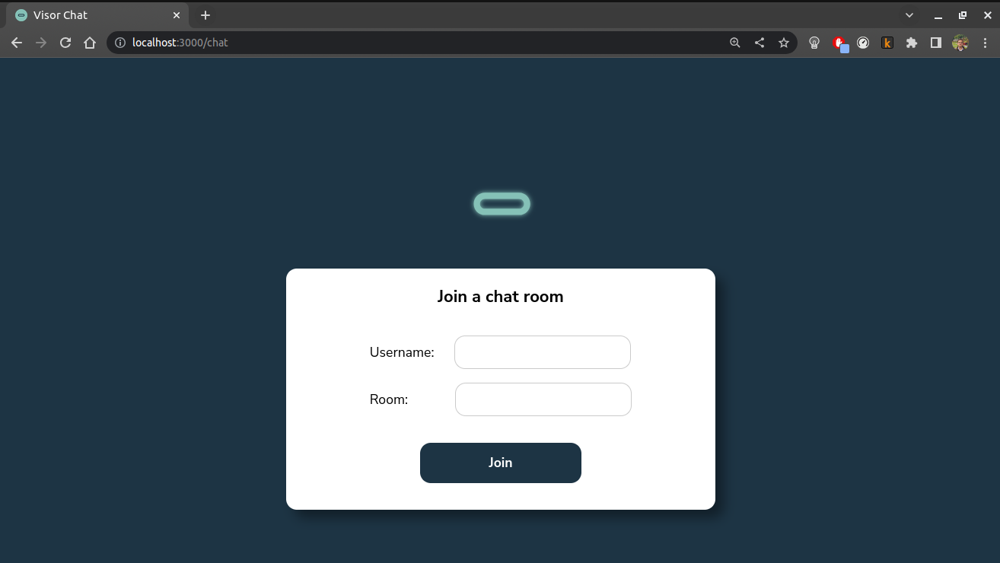
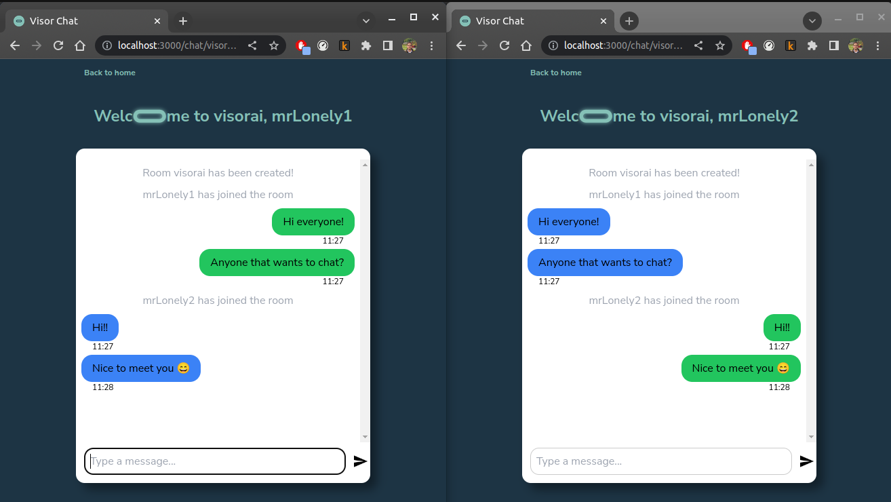
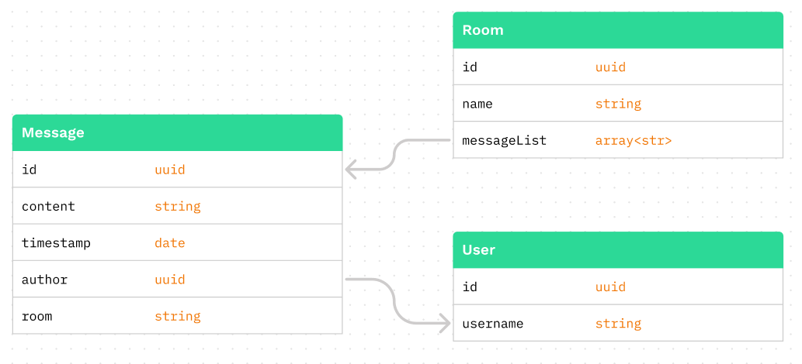

<!-- PROJECT LOGO -->
<br />
<div align="center">
    <a>
    
    </a>

  <h2 align="center">Visor Chat</h2>

  <p align="center">
    Live room chat application for Visor.ai web code challenge
    <br />
    <br />
    <br />
  </p>
</div>


### Description
Visor Chat is a full stack web application using **Socket.io** to handle messaging, **React**, **Next.Js**, **TailwindCSS** and **Axios** for front-end with **NodeJs**, **Express** and **Mongoose** for the REST API. Messages are persisted and can be seen later because of a NoSQL **MongoDB** database.
Through Visor Chat you can message your friends and strangers that join the same room as you, as long as you are on the same private network. To run the application its simple with **Docker compose**, just follow the instructions below. 


### Running the app
You'll need `docker` and `docker compose` installed to run the application. 
1. Clone the repo and go to the `production` branch or download the ZIP from `production`. There you'll find the Dockerfiles.

2. Confirm that you are in the root of the project (`/visor/.`) where the `docker-compose.yml` file is and build the images:

```
docker compose build
```
And wait for the build to finish. It should take around 20 seconds. 

3. Run the app with docker compose.

```
docker compose up
``` 
This command will start the visor-ui, visor-api and visor-mongo containers that will be available on your machine's ports `3000`, `3005` and `27018` respectively.
Now just open your browser of choice and go to http://localhost:3000/ to use Visor Chat!


Messaging apps only work with friends, but if you don't have any ( 😢 ) you can just open other browser tabs and try it out. 


### Details
Data models


